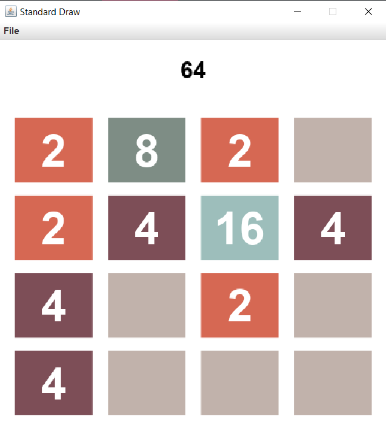
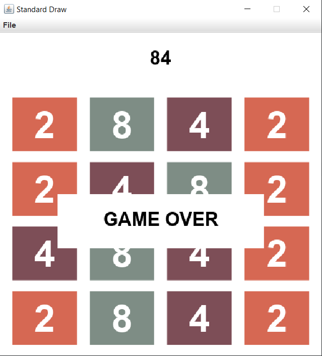

# 2048
## Summary
This is a simple recreation of a popular game called "2048" with StdDraw.

2048 is a single-player sliding block puzzle game designed by the Italian web developer Gabriele Cirulli.
The game's objective is to slide numbered tiles on a grid to combine them to create a tile with the number 2048.
However, one can continue to play the game after reaching the goal, creating tiles with larger numbers.

2048 was originally written in JavaScript and CSS during a weekend, and released on 9 March 2014, as free and open-source
software subject to the MIT license. Clones written in C++ and Vala are available. There is also a version for the Linux terminal.

## Rules
2048 is played on a gray 4×4 grid, with numbered tiles that slide smoothly when a player moves them using the four arrow keys.
Every turn, a new tile will randomly appear in an empty spot on the board with a value of either 2 or 4.Tiles slide as far
as possible in the chosen direction until they are stopped by either another tile or the edge of the grid. If two tiles of the same
number collide while moving, they will merge into a tile with the total value of the two tiles that collided.
The resulting tile cannot merge with another tile again in the same move. The end of the game is followed by a window saying "GAME OVER".

## Run the app
From the root folder of the app:  
`cd src`  
`javac Main.java`  
`java Main`
...and then with the arrow keys click you start the game and use them until you lose.

## Preequisites

You need to have java installed.

